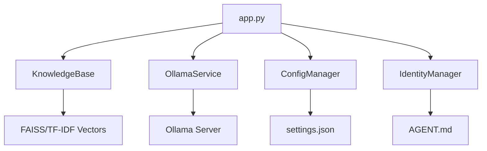
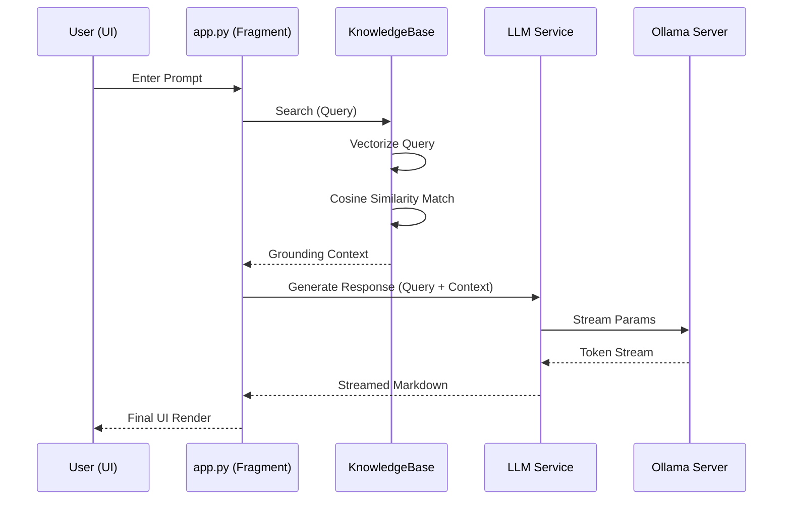

# Architecture Design & Design Philosophy
=========================================

The NLP Workspace is built as a **Hybrid-Engine Semantic Hub**. This architecture was chosen to balance the raw speed of traditional statistics with the contextual depth of modern AI.

## 🏗️ The 4-Layer Modular Structure

We follow a strict **Separation of Concerns** to ensure the project remains maintainable as it grows:

1.  **Orchestration Layer (`app.py`)**: The "Management Hub". It manages Streamlit's session state and UI rendering.
2.  **Intelligence Engines (`core/`)**: The "Brain".
    - `knowledge_base.py`: Handles vectorization and search.
    - `llm_service.py`: Handles LLM communication.
    - `identity_manager.py`: Manages agent persona.
    - `config_manager.py`: Manages user settings.
3.  **Utility & Interface (`utils/`)**: The "Toolbox".
    - `ui_components.py`: Centralizes CSS and layouts.
    - `file_processor.py`: Handles multi-format data ingestion.
4.  **Persistence Layer (`data/`)**: The "Memory". Stores context vectors and user preferences.

---

## 🔄 The Query Lifecycle

Understanding how a user's prompt travels through the system:

1.  **Ingestion**: `app.py` captures the user input via `st.chat_input`.
2.  **Fragment Orchestration**: The query is processed inside an `@st.fragment` to prevent UI flicker.
3.  **Context Retrieval**:
    -   The system sends the query to `KnowledgeBase.get_context_for_query`.
    -   Chunks that pass the `neural_threshold` are returned as the "Ground Truth."
4.  **RAG Generation**:
    -   `llm_service.py` receives the query + context and injects them into the system prompt.
5.  **Analytics**: Token usage and inference speed are captured and displayed.

---

## 🧠 Design Philosophy

### 1. "Hybrid First"
By providing both **Machine Learning** (TF-IDF) and **Deep Learning** (Neural) engines, the user is never locked into a single implementation. This allows for rapid keyword-based "sanity checks" before running expensive neural queries.

### 2. Pedagogy Through Code (PTC)
The codebase is **heavily documented** at the top of every file and within every complex method. This is designed so a new developer can learn the theory of NLP simply by reading the source code.

### 3. Local-First Privacy
All processing happens Locally.
- **Ollama** ensures LLM data stays on-device.
- **Scikit-learn** ensures statistical data stays on-device.
- This architecture was chosen to satisfy high-security requirements for sensitive internal documentation.

### 4. Zero-Flicker Experience (State Isolation)
We prioritize a stable UI. Logic that updates frequently (like the chat or progress bars) is isolated into **Fragments** so the global application state remains accessible and un-interrupted.

